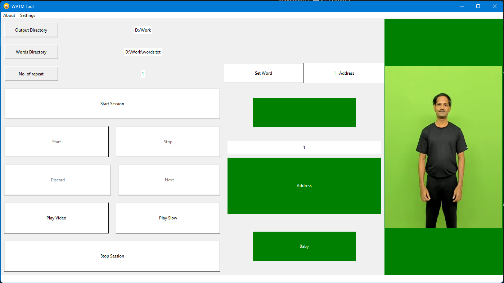
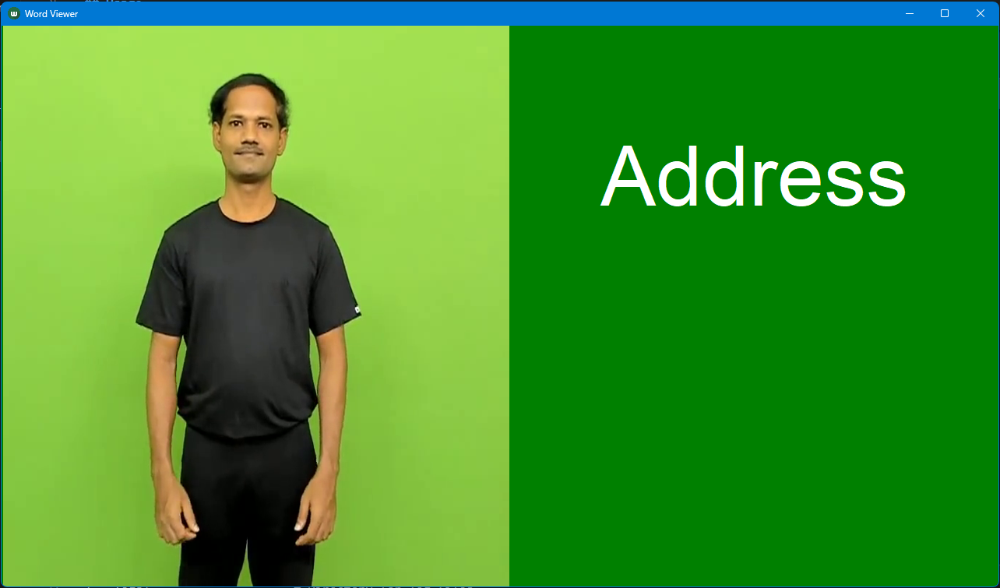

# Isolated Sign Language recording and annotation 

Welcome to the GitHub repository for automative Isolated Sign Language recording and annotation. It includes Word Viewer and Timeline Manager (WVTM), a custom tool designed to assist in making Isolated Sign Language dataset and annotation script which automatically annotate and splits a large corpus of videos. This repository is primarily for linguistic and sign language research, assisting in the recording process and annotation of sign words with precise timestamps.




To utilize the automatic annotation process remember to use three monitors-

- 1st one for the operator with the control panel in it.
- 2nd one in front of the subject to show the prompts.
- 3rd one in the background to use the color in image frame for the automated annotation.

**!!!Note:** Mirror the 2nd and 3rd screen.

## Features

- **Word Viewing:** Displays sign words with video and prompts to the subject for recording.
- **Timeline Management:** Automatically registers event timestamps, such as session start, word recording start/stop, next word, discard previous, discard word, session end.
- **Log File Generation:** Creates a detailed log file with all the event timestamps for easy annotation and analysis.
- **Dataset Creation:** Splits the videos according to the log file and generated a dataset.

## Table of Contents

- [Installation](#installation)
- [Usage](#usage)
- [License](#license)

## Installation

### Prerequisites

- Python 3.7 or higher
- `tkinter`

### Steps

1. Clone the repository:
   ```bash
   git clone https://github.com/suvajit790/SL-data-collection-and-annotation.git
   cd ISL-data-collection-and-annotation
   ```

## Usage

### Start Recording
First run the following command to generate folders.
```
python recording_utils/make_folders.py -d /data/data_raw -n subject_name
```

Use any video recording software to record the video of a subject and start recording.

### Starting a Session

1. Run the WVTM application:
   ```
   cd wvtm
   python wvtm.py
   ```
   If you have video prompts then put the videos in the `wvtm/assets/videos` folder and run
   ```
   cd wvtm
   python wvtm.py
   ```
   **!!!Note:** videos should have same name as words with `.mp4` extension.

2. Use the GUI to start a new session. The operator will be prompted to input the necessary details, such as the words directory and timestamp log save directory.

### Recording Words
1. Select a sign word from the word list.
2. Show the sign word and prompt to the subject.
3. Click "Start" to begin capturing the word.
4. Click "Stop" once the word recording is complete.
5. Either click "Discard" to discard the last recorded video or "Next" to go to the next word and repeat.

### Ending a Session

1. Click "Stop Session" to finalize the session.
2. A log file will be generated with all the timestamps of events recorded during the session.

### Log File

The log file contains detailed timestamps for each event, including session start, word recording start/stop, next word, discard previous, discard word, session end. This log file is essential for subsequent annotation and analysis of the recorded videos.

### Annonation Process

1. Check the timestamp log files.
```
python recording_utils/check_rec.py -in /data/data_raw/subject_name
cd raw_dataset_process/process_code
```
2. Generate commands for a specific subject.
```
python commands_gen.py -n name -id subject_id -in /data/data_raw -out /data/data_processes
```
3. Run the commands, generated in the previous step to split the videos and name the splits with their corresponding words.

## License

This project is licensed under the MIT License. See the [LICENSE](LICENSE) file for details.

---

Thank you for using this repository. If you have any questions or need further assistance, please open an issue in this repository.

---